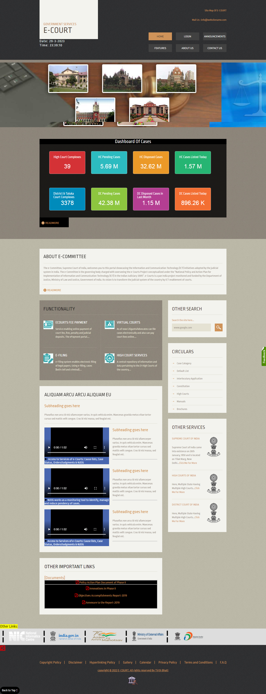

# E-COURT

<link rel="preconnect" href="https://fonts.gstatic.com" crossorigin>
<link href="https://fonts.googleapis.com/css2?family=Fira+Code&display=swap" rel="stylesheet">

Uploaded On: 31 March 2023 [Friday]
    
***

# Description

i made web project which name is "E-COURT" , it has three modules.
1. Client
2. Advocate
3. Judge

- frontpanel for display public and basic details.
- backpanel {after login} that data for applied clients,advocates.

all are three have own credentials and share online information about publicaly data.

***

***

Here I shared about used technologies,frameworks and so on...

    
 Technologies 

***

- [HTML](http://www.w3schools.com/html/default.asp) - A markup language for describing web documents.

- [CSS](http://www.w3schools.com/css/default.asp) - A style sheet language used for describing the look and formatting of a document written in a markup language.

- [ASP.net](https://dotnet.microsoft.com/en-us/apps/aspnet) - the dot-Net version of ASP, introduced by Microsoft, for creating dynamic web pages by using server-side scripts. ASP.Net applications are compiled codes written using the extensible and reusable components or objects present in .Net framework. These codes can use the entire hierarchy of classes in .Net framework.

- [Java Script](http://www.w3schools.com/js/default.asp) - A programming language of the Web.

- [Masterpage](https://learn.microsoft.com/en-us/previous-versions/aspnet/18sc7456(v=vs.100)) - A Master Page enables us to share the same content among multiple content pages in a website.

- [Bootstrap](https://getbootstrap.com/) - Bootstrap is a free and open-source CSS framework directed at responsive, mobile-first front-end web development.

- [Font Awesome](https://fontawesome.com/) - Font Awesome is the Internet's icon library and toolkit, used by millions of designers, developers, and content creators.

- [SQL Server Management Studio](https://learn.microsoft.com/en-us/sql/ssms/download-sql-server-management-studio-ssms?view=sql-server-ver16) - Microsoft SQL Server Management Studio is a software application developed by Microsoft that is used for configuring, managing, and administering all components within Microsoft SQL Server.

- [Microsoft® SQL Server® 2014 Express](https://learn.microsoft.com/en-us/sql/ssms/sql-server-management-studio-ssms?redirectedfrom=MSDN&view=sql-server-ver16) - Microsoft SQL Server 2014 Express is a powerful and reliable free data management system that delivers a rich and reliable data store for lightweight Web Sites and desktop applications.

- [Visual Studio 2012](https://visualstudio.microsoft.com/) - Visual Studio is an integrated development environment (IDE) from Microsoft. It is used to develop computer programs including websites, web apps, web services and mobile apps. Visual Studio uses Microsoft software development platforms.

- [cdnjs](https://cdnjs.com/) - cdnjs is a free and open-source software content delivery network hosted by Cloudflare. 

*[Back to top](#description)*

 

